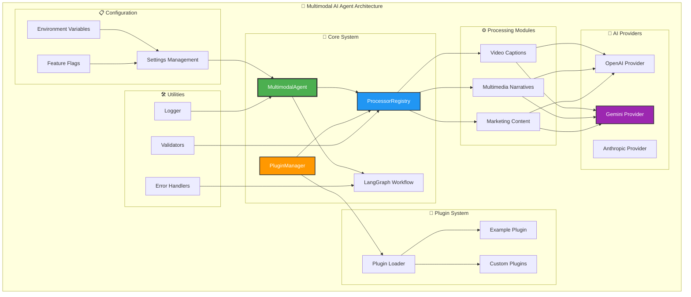

# 🤖 Multimodal AI Agent for Content Creation and Analysis

A comprehensive AI agent that combines **LangChain** and **LangGraph** to create multimodal content including video captions, interactive multimedia narratives, and targeted marketing content by analyzing and combining visual and textual data.

## ✨ Features

### 🎬 Video Caption Generation
- **Automated frame extraction** from video files
- **AI-powered caption generation** using GPT-4 Vision
- **SRT subtitle format** export
- **Batch processing** for multiple videos
- **Contextual understanding** for improved accuracy

### 📚 Interactive Multimedia Narratives  
- **Dynamic story creation** with multiple narrative structures
- **Media element integration** (images, videos, audio)
- **Interactive components** (choices, hotspots, branching paths)
- **Multiple narrative templates** (hero's journey, problem-solution, etc.)
- **Audience-targeted content** generation

### 🎯 Targeted Marketing Content
- **Multi-platform content** optimization (social media, email, ads)
- **Visual analysis integration** for brand consistency
- **Audience insight generation** and personalization
- **Competitive analysis** integration
- **Brand voice adaptation** across channels

### 🔄 LangGraph Workflow Orchestration
- **Intelligent task routing** based on input analysis
- **Error handling and recovery** mechanisms
- **Parallel processing** capabilities
- **State management** throughout workflows
- **Extensible architecture** for custom workflows

### 🔧 Modular & Extensible Architecture
- **Plugin system** for adding custom functionality
- **Multi-provider AI support** (OpenAI, Gemini, Anthropic)
- **Abstract base classes** for consistent processor interfaces
- **Registry system** for dynamic processor management
- **Configuration-driven** setup and customization

## 🏗️ System Architecture

The multimodal AI agent follows a modular, extensible architecture that promotes scalability and maintainability:



### Key Components:

- **🔧 Core System**: Central orchestration and workflow management
- **🎯 AI Providers**: Pluggable AI service integrations (OpenAI, Gemini, Anthropic)
- **⚙️ Processing Modules**: Specialized content creation capabilities
- **🔌 Plugin System**: Dynamic extension mechanism for custom functionality
- **📋 Configuration**: Environment-based settings and feature management
- **🛠️ Utilities**: Supporting infrastructure for logging, validation, and error handling

## 🚀 Quick Start

### Prerequisites

- Python 3.8+
- OpenAI API key
- FFmpeg (for video processing)

### Installation

### Option 1: Automated Setup (Recommended)

1. **Clone the repository:**
```bash
git clone <repository-url>
cd multimodal-ai-agent
```

2. **Run the setup script:**
```bash
python setup.py
```

The setup script will automatically:
- Check system dependencies
- Install Python packages
- Configure environment variables
- Create necessary directories
- Test the installation

### Option 2: Manual Setup

1. **Clone and install dependencies:**
```bash
git clone <repository-url>
cd multimodal-ai-agent
pip install -r requirements.txt
```

2. **Set up environment variables:**
```bash
# Copy the environment template
cp env.template .env

# Edit .env file with your API keys
nano .env
```

3. **Run the demo:**
```bash
python main.py
```

## 📖 Usage Examples

### Video Caption Generation

```python
import asyncio
from multimodal_agent import MultimodalAgent

async def generate_video_captions():
    agent = MultimodalAgent()
    
    result = await agent.generate_video_captions(
        video_path="path/to/video.mp4",
        context="Educational content about AI"
    )
    
    if result["status"] == "success":
        captions = result["data"]["captions"]
        print(f"Generated {len(captions['frame_captions'])} captions")
        print(f"Summary: {captions['summary']}")

asyncio.run(generate_video_captions())
```

### Interactive Multimedia Narrative

```python
async def create_narrative():
    agent = MultimodalAgent()
    
    result = await agent.create_multimedia_narrative(
        topic="The Future of AI",
        media_elements=[
            "An image of a futuristic robot",
            "A chart showing AI development timeline",
            "A video of AI applications"
        ],
        style="engaging",
        target_audience="technology enthusiasts"
    )
    
    if result["status"] == "success":
        narrative = result["data"]["narrative"]
        print(f"Title: {narrative['title']}")
        print(f"Segments: {len(narrative['segments'])}")

asyncio.run(create_narrative())
```

### Marketing Content Creation

```python
async def create_marketing_content():
    agent = MultimodalAgent()
    
    product_info = {
        "name": "AI Study Assistant",
        "description": "Smart learning companion",
        "category": "EdTech",
        "key_features": ["Personalized paths", "AI quizzes"],
        "benefits": ["40% efficiency improvement", "24/7 availability"]
    }
    
    result = await agent.create_marketing_content(
        product_info=product_info,
        target_audience="college students aged 18-25",
        content_type="social_media_post"
    )
    
    if result["status"] == "success":
        content = result["data"]["marketing_content"]
        print(f"Title: {content.title}")
        print(f"Content: {content.content}")

asyncio.run(create_marketing_content())
```

## 🏗️ Project Structure

```
multimodal_agent/
├── core/
│   └── agent.py              # Main MultimodalAgent class with LangGraph
├── modules/
│   ├── video_captions/       # Video processing and caption generation
│   ├── multimedia_narratives/ # Interactive story creation
│   └── marketing_content/    # Marketing content generation
├── utils/
│   └── logger.py            # Logging utilities
├── config/
│   └── settings.py          # Configuration management
└── examples/                # Usage examples and demos

main.py                      # Main application with demos
requirements.txt             # Python dependencies
README.md                   # This file
```

## ⚙️ Configuration

The agent can be configured through environment variables or the `settings.py` file:

### Environment Variables

```bash
# API Configuration
OPENAI_API_KEY=your_openai_api_key
GEMINI_API_KEY=your_gemini_api_key
HUGGINGFACE_API_TOKEN=your_hf_token  # Optional
ANTHROPIC_API_KEY=your_anthropic_key  # Optional

# Model Configuration  
DEFAULT_VISION_MODEL=gpt-4-vision-preview
DEFAULT_TEXT_MODEL=gpt-4-turbo-preview
DEFAULT_EMBEDDING_MODEL=text-embedding-ada-002

# Gemini Configuration
GEMINI_MODEL=gemini-2.0-flash-exp
GEMINI_VISION_MODEL=gemini-2.0-flash-exp

# Default AI Provider
DEFAULT_AI_PROVIDER=openai  # Options: openai, gemini, anthropic

# Processing Settings
MAX_VIDEO_DURATION=300       # 5 minutes
VIDEO_FRAME_SAMPLE_RATE=1    # 1 frame per second
MAX_NARRATIVE_LENGTH=5000    # characters

# Storage
CONTENT_STORAGE_PATH=./data/content
OUTPUT_STORAGE_PATH=./data/output
```

### Programmatic Configuration

```python
from multimodal_agent.config import settings

# Modify settings
settings.max_video_duration = 600  # 10 minutes
settings.video_frame_sample_rate = 0.5  # 0.5 frames per second

# Initialize agent with custom settings
agent = MultimodalAgent()
```

## 🎯 Use Cases

### Content Creators
- **Automatic video subtitles** for YouTube, courses, podcasts
- **Interactive story creation** for educational content
- **Social media content** generation across platforms

### Marketing Teams  
- **Product video analysis** and caption generation
- **Campaign narrative** development
- **Multi-platform content** optimization
- **Visual brand analysis** and consistency

### Educational Institutions
- **Course material** captioning and accessibility
- **Interactive learning** content creation
- **Curriculum narrative** development

### Businesses
- **Training video** captioning and analysis
- **Product documentation** in multimedia format
- **Customer education** content creation

## 🔧 Advanced Features

### Custom Workflow Creation

```python
from multimodal_agent.core.agent import MultimodalAgent
from langgraph.graph import StateGraph

# Extend the agent with custom workflows
class CustomAgent(MultimodalAgent):
    def _build_custom_workflow(self):
        workflow = StateGraph(AgentState)
        # Add custom nodes and edges
        return workflow
```

### Batch Processing

```python
# Process multiple items in parallel
async def batch_process():
    agent = MultimodalAgent()
    
    tasks = [
        agent.generate_video_captions(video) 
        for video in video_list
    ]
    
    results = await asyncio.gather(*tasks)
    return results
```

### Plugin Architecture

The agent supports a comprehensive plugin system for extending functionality:

```python
from multimodal_agent.core.base import PluginInterface, BaseProcessor

class CustomPlugin(PluginInterface):
    def get_name(self) -> str:
        return "my_custom_plugin"
    
    def get_version(self) -> str:
        return "1.0.0"
    
    def get_description(self) -> str:
        return "Custom functionality for my use case"
    
    async def initialize(self, registry) -> bool:
        # Register custom processors
        processor = MyCustomProcessor(config)
        return registry.register_processor(processor)
    
    async def cleanup(self) -> bool:
        # Cleanup resources
        return True

# Load and use plugin
from multimodal_agent.core.plugin_manager import global_plugin_manager

await global_plugin_manager.load_and_initialize_plugin("my_custom_plugin")
```

### Multi-Provider AI Support

Switch between different AI providers seamlessly:

```python
from multimodal_agent.providers import OpenAIProvider, GeminiProvider

# Use OpenAI
openai_provider = OpenAIProvider(api_key="your-key")
text = await openai_provider.generate_text("Hello world")

# Use Gemini
gemini_provider = GeminiProvider(api_key="your-key") 
text = await gemini_provider.generate_text("Hello world")

# Analyze images with either provider
image_analysis = await provider.analyze_image(image_data, "Describe this image")
```

## 📊 Performance & Limitations

### Performance Characteristics
- **Video processing**: ~2-5 seconds per minute of video
- **Narrative generation**: ~10-30 seconds for 5-segment story
- **Marketing content**: ~5-15 seconds per content piece
- **Concurrent processing**: Supports parallel execution

### Current Limitations
- **Video duration**: Default 5-minute limit (configurable)
- **File formats**: Common formats supported (MP4, AVI, MOV)
- **API dependencies**: Requires OpenAI API access
- **Language support**: Primarily English (extensible)

### Recommended Hardware
- **Minimum**: 4GB RAM, 2-core CPU
- **Recommended**: 8GB+ RAM, 4-core+ CPU
- **Storage**: 1GB+ free space for processing

## 🤝 Contributing

We welcome contributions! Here's how to get started:

1. **Fork the repository**
2. **Create a feature branch**: `git checkout -b feature/amazing-feature`
3. **Make your changes** and add tests
4. **Commit**: `git commit -m 'Add amazing feature'`
5. **Push**: `git push origin feature/amazing-feature`
6. **Open a Pull Request**

### Development Setup

```bash
# Clone for development
git clone <repository-url>
cd multimodal-ai-agent

# Install in development mode
pip install -e .

# Install development dependencies
pip install -r requirements-dev.txt

# Run tests
python -m pytest tests/
```

## 📝 License

This project is licensed under the MIT License - see the [LICENSE](LICENSE) file for details.

## 🙏 Acknowledgments

- **LangChain & LangGraph** for the AI workflow framework
- **OpenAI** for the vision and language models
- **OpenCV** for video processing capabilities
- **Streamlit** for web interface components

## 📞 Support & Contact

- **Author**: Anuj Patel
- **Email**: [amp10162@nyu.edu](mailto:amp10162@nyu.edu)
- **Website**: [panuj.com](https://www.panuj.com)
- **Documentation**: [Coming Soon]
- **Issues**: [GitHub Issues](../../issues)
- **Discussions**: [GitHub Discussions](../../discussions)

---

⭐ **Star this repository** if you find it useful!

**Created by [Anuj Patel](https://panuj.com) • Built with ❤️ using LangChain, LangGraph, and OpenAI GPT-4 Vision** 